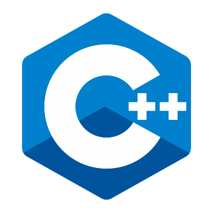

# C++ _PDC _#08

## :copyright: Autor

- :camera: 

- :man: **Miguel Angel Rojas Herrera**
- :e-mail: m_rojas18@unitec.edu
- :link: [github.com/m_rojas18](https://github.com/m-rojas18)
- :calendar: 2020-08-30 18:00 CST

---
## :dart: Objetivos

Punto de Control #08 en C++ mostrara:

1. Uso de Makefile para compilar un programa

2. Identificar la diferencia entre distintos tipos de compilación usando makefile

2. Uso de ncurses para manejar ventanas

## Asignación 1
## Asignación 2
## :black_large_square: Asignacion2_PDC8.cpp

## :computer: Código
- :blue_book: [Punto de Control #08] (https://github.com/m-rojas18/C_PDC8.git)

#### Herramientas:
- :package: [Visual Studio Code](https://code.visualstudio.com/)
- :camera: [Polacode-2020 v0.5.2](https://github.com/jeff-hykin/polacode)
- :notebook: [Markdown Cheatsheet](https://github.com/adam-p/markdown-here/wiki/Markdown-Cheatsheet)
- :smile: [Emoji Cheat Sheet](https://www.webfx.com/tools/emoji-cheat-sheet/)
